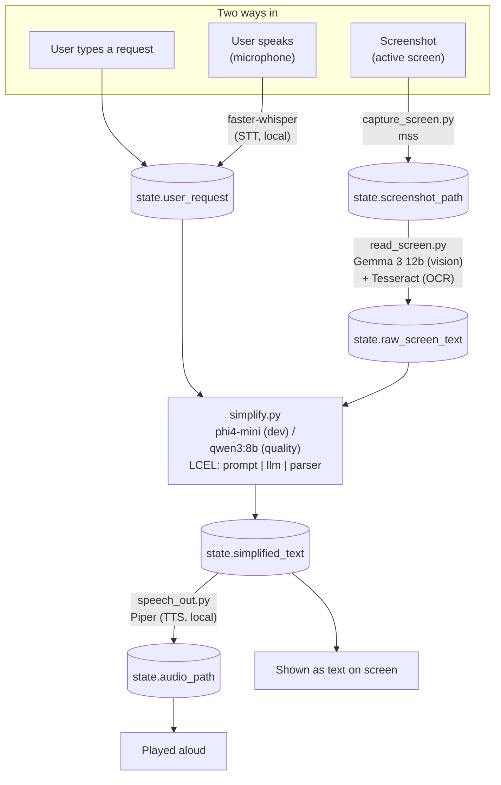

# Architecture — models & data flow

This is a quick-reference map of every model, node, and file in the pipeline,
and how state flows between them. For the full phased build spec see
`PROJECT_PLAN.md`.

## Pipeline diagram

## Models in use (all local via Ollama, except STT/TTS which are separate local libs)

| Model / lib | Role | Used in | Resident in RAM |
|---|---|---|---|
| `phi4-mini` | Fast text simplify/translate (dev loop) | `src/nodes/simplify.py` | one at a time |
| `qwen3:8b` | Higher-quality text simplify/translate | `src/nodes/simplify.py` (swap-in) | one at a time |
| `gemma3:12b` | Vision — reads screenshot layout/content | `src/nodes/read_screen.py` | one at a time |
| Tesseract OCR | Exact text extraction, paired with vision | `src/nodes/read_screen.py` | n/a (CPU, not a model) |
| faster-whisper | Speech-to-text (mic → `user_request`) | `src/nodes/speech_in.py` | one at a time |
| Piper | Text-to-speech (`simplified_text` → audio) | `src/nodes/speech_out.py` | one at a time |

Only one Ollama model is ever loaded at once — Ollama swaps automatically when
a node calls a different model. This is why the pipeline is **sequential**:
each node finishes and hands off through `AssistantState`, never running two
models in parallel.

## Node-by-node state flow

| Node (file) | Reads from state | Writes to state |
|---|---|---|
| `capture_screen.py` | — | `screenshot_path` |
| `read_screen.py` | `screenshot_path` | `raw_screen_text`, `ocr_text` |
| `speech_in.py` (Phase 4) | mic audio (not state) | `user_request` |
| `simplify.py` | `raw_screen_text` or `user_request`, `target_language` | `simplified_text` |
| `speech_out.py` (Phase 4) | `simplified_text`, `target_language` | `audio_path` |

`src/graph.py` wires these nodes into a `StateGraph`. Inputs converge on
`simplify` via a conditional edge from `START` (`route_start`), and an
optional `speech_out` step runs after `simplify` if `speak_output` is set
(`route_after_simplify`), matching the diagram in `PROJECT_PLAN.md`.

## Session memory

The graph is compiled with an `InMemorySaver` checkpointer
(`src/graph.py`). Every `graph.invoke()` call passes a `thread_id` in its
`config`; calls sharing a `thread_id` read/write the same persisted state,
which is how a session "remembers" earlier turns. `src/app.py` generates one
`thread_id` per browser session and keeps a simple `history` list in
`st.session_state` to display past exchanges in the sidebar. Nothing is
written to disk -- memory is cleared when the process exits, consistent with
the local-only, nothing-persists design.

## Known limitations (intentional, not yet built)

- **No human-in-the-loop confirmation gate.** The plan calls for one before
  any consequential action (e.g. submitting a form), but this app doesn't
  perform any such action yet -- there's nothing for the gate to guard. Add
  it if/when a real submit-style action is introduced.
- **Streaming** only covers the "Type" tab in `src/app.py` (direct
  `simplify_chain.stream()` call). The voice and screen-reading tabs go
  through OCR/vision/STT first, so the wait is dominated by those steps, not
  token generation -- streaming there would add complexity for little
  visible benefit.
