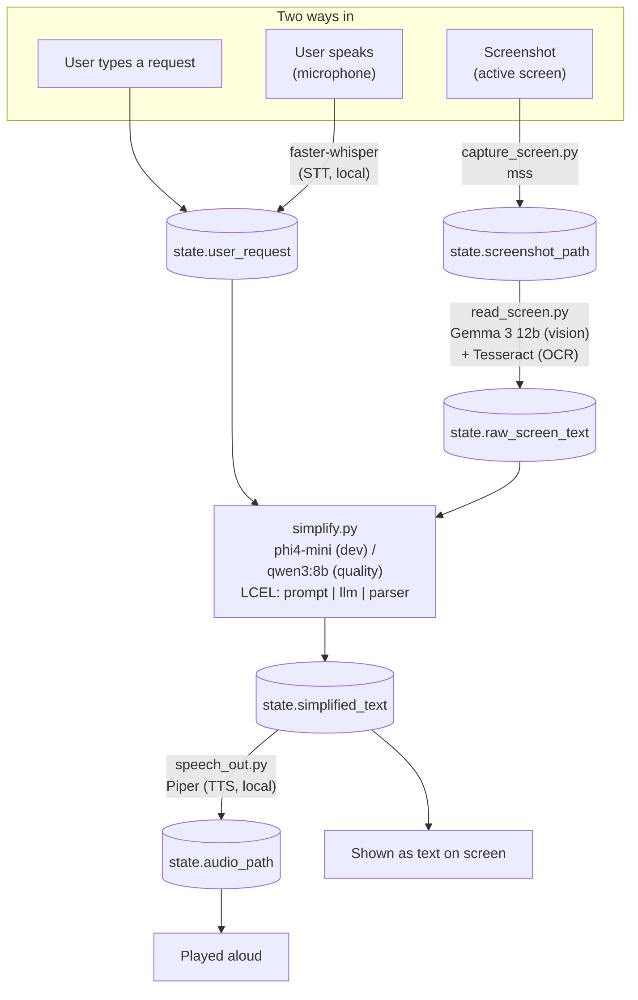

# Architecture — models & data flow

This is a quick-reference map of every model, node, and file in the pipeline,
and how state flows between them. For the full phased build spec see
`PROJECT_PLAN.md`.

## Pipeline diagram

## Models in use (all local via Ollama, except STT/TTS which are separate local libs)

| Model / lib | Role | Used in | Resident in RAM |
|---|---|---|---|
| `phi4-mini` | Fast text simplify/translate, selectable in the UI as "Fast" | `src/nodes/simplify.py` | one at a time |
| `qwen3:8b` | Higher-quality text simplify/translate, selectable as "Higher quality" | `src/nodes/simplify.py` | one at a time |
| `gemma3:12b` | Vision — reads screenshot layout/content. **Only called when OCR comes up short** (fallback, not the default path) -- it's ~1-2 minutes on CPU vs. OCR's near-instant, so OCR alone is used whenever it extracts enough text | `src/nodes/read_screen.py` | one at a time |
| Tesseract OCR | Exact text extraction; the primary/fast path for `read_screen.py` | `src/nodes/read_screen.py` | n/a (CPU, not a model) |
| faster-whisper | Speech-to-text (mic → `user_request`) | `src/nodes/speech_in.py` | one at a time |
| Piper | Text-to-speech (`simplified_text` → audio) | `src/nodes/speech_out.py` | one at a time |

Only one Ollama model is ever loaded at once — Ollama swaps automatically when
a node calls a different model. This is why the pipeline is **sequential**:
each node finishes and hands off through `AssistantState`, never running two
models in parallel.

## Node-by-node state flow

| Node (file) | Reads from state | Writes to state |
|---|---|---|
| `capture_screen.py` | — | `screenshot_path` |
| `read_screen.py` | `screenshot_path` | `raw_screen_text`, `ocr_text` |
| `speech_in.py` (Phase 4) | mic audio (not state) | `user_request` |
| `simplify.py` | `raw_screen_text` or `user_request`, `target_language` | `simplified_text` |
| `speech_out.py` (Phase 4) | `simplified_text`, `target_language` | `audio_path` |

`src/graph.py` wires these nodes into a `StateGraph`. Inputs converge on
`simplify` via a conditional edge from `START` (`route_start`), and an
optional `speech_out` step runs after `simplify` if `speak_output` is set
(`route_after_simplify`), matching the diagram in `PROJECT_PLAN.md`.

Every node is wrapped with `@timed_node(...)` (`src/nodes/_timing.py`),
which prints how long it took, e.g. `[simplify] took 7.6s`. `read_screen.py`
additionally prints OCR time and vision time separately. This is what
should be checked first whenever something feels slow -- it'll show
immediately whether the bottleneck is a particular node, rather than
needing to manually watch CPU usage to guess.

## Session memory

The graph is compiled with an `InMemorySaver` checkpointer
(`src/graph.py`). Every `graph.invoke()` call passes a `thread_id` in its
`config`; calls sharing a `thread_id` read/write the same persisted state,
which is how a session "remembers" earlier turns. `src/app.py` generates one
`thread_id` per browser session and keeps a simple `history` list in
`st.session_state` to display past exchanges in the sidebar. Nothing is
written to disk -- memory is cleared when the process exits, consistent with
the local-only, nothing-persists design.

## Performance gotchas found during testing

- **Qwen3 "thinking" mode.** `qwen3:8b` defaults to generating a full
  chain-of-thought before its visible answer, which doesn't help (or show
  up) for a direct simplify/translate task but adds huge latency (observed
  172s vs. 21s for the same request). `src/nodes/simplify.py` passes
  `reasoning=False` to `ChatOllama` to disable it.
- **Ollama RAM contention.** Without `OLLAMA_MAX_LOADED_MODELS=1`, Ollama
  keeps multiple models resident if there's room, causing severe slowdown
  from memory pressure (84s vs. 17s -- see README Setup).
- **Ollama's implicit `:latest` tag.** A model pulled without an explicit
  tag (e.g. `phi4-mini`) is reported back by `/api/tags` as
  `phi4-mini:latest`. `src/setup_check.py` strips this before comparing.

## Safety net: form-number corruption

Small CPU models occasionally garble alphanumeric identifiers while
rephrasing -- observed `phi4-mini` turning "Form RRB-1099" into
"Form RR-BR-1099" in roughly 1 of 5 runs. That's exactly the kind of fact
corruption this project's "never invent/corrupt facts" principle exists to
prevent, so it isn't left to the model: `src/nodes/simplify.py` extracts
`Form <identifier>` patterns from the source text with a regex
(`FORM_NUMBER_PATTERN`) and, if any are missing or altered in the model's
output, appends them back verbatim (untranslated, since they're literal
identifiers) under a translated label (`FORM_REFERENCE_LABEL` in
`config.py`).

## Human-in-the-loop confirmation gate

Capturing the screen reads everything currently visible -- not just the
document the user means to share, but any other open window, notification,
etc. -- so it's gated by a confirmation step using LangGraph's `interrupt()`:

- `confirm_screen_capture_node` (`src/nodes/capture_screen.py`) is the first
  node on the `capture_screen` path. It calls `interrupt({"message": ...})`,
  which pauses the graph; `graph.invoke()` returns
  `{"__interrupt__": [Interrupt(value=...)]}` instead of a normal result.
  The node does nothing else (no side effects), so it's safe to re-run on
  resume, which is what LangGraph does.
- `route_after_confirm` (`src/routing.py`) sends the graph to
  `capture_screen` if `state["capture_confirmed"]` is `True`, otherwise to
  `END` with a translated "cancelled" notice in `state["info"]`.
- `src/app.py` detects the `__interrupt__` key, shows the message via
  `st.warning` with Yes/Continue and Cancel buttons, and resumes with
  `graph.invoke(Command(resume=True_or_False), config=graph_config)` --
  the same `thread_id`-keyed checkpointer used for session memory is what
  makes resuming the *same* paused run possible.

No other action in the app is gated this way (yet) -- typing text, speaking,
and speaking the result aloud don't read anything beyond what the user
explicitly provided.

## Known limitations (intentional, not yet built)

- **Streaming** only covers the "Type" tab in `src/app.py` (direct
  `get_chain(text_model).stream()` call). The voice and screen-reading tabs go
  through OCR/vision/STT first, so the wait is dominated by those steps, not
  token generation -- streaming there would add complexity for little
  visible benefit.
